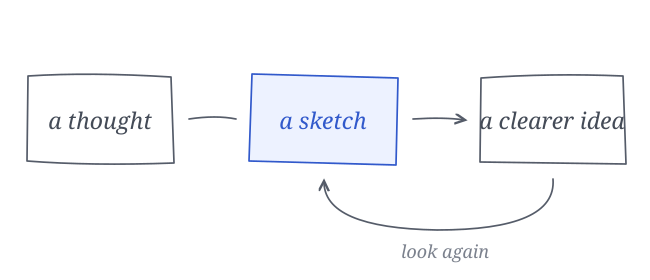

Some ideas make sense in your head until you try to explain them. A sentence gets longer. A definition needs another definition. You find yourself saying, “Let me back up.”

That’s a good moment to draw something.

## A drawing is a question

Start with a box. Give it a name. Add a second box, then an arrow between them. The interesting part isn’t whether the drawing looks good. It’s whether you can explain what the arrow means.

Does one thing cause the other? Does information move between them? Is there a step you’ve quietly skipped? The drawing asks you to make a choice that a paragraph might let you avoid.

## Keep it rough

A rough sketch leaves room to change your mind. Move the boxes. Cross out an arrow. Add the thing you forgot. The less precious the drawing feels, the easier it is to think with it.

This is where a tool like Excalidraw fits naturally: a few shapes, a little text, and enough space to rearrange your understanding.

## Come back to the words

The diagram doesn’t have to explain everything. Let it show the relationship, then use the words to explain why that relationship matters.

Try it with the next idea you’re struggling to explain. Draw three things and the connections between them. Then write the sentence you couldn’t find before.
